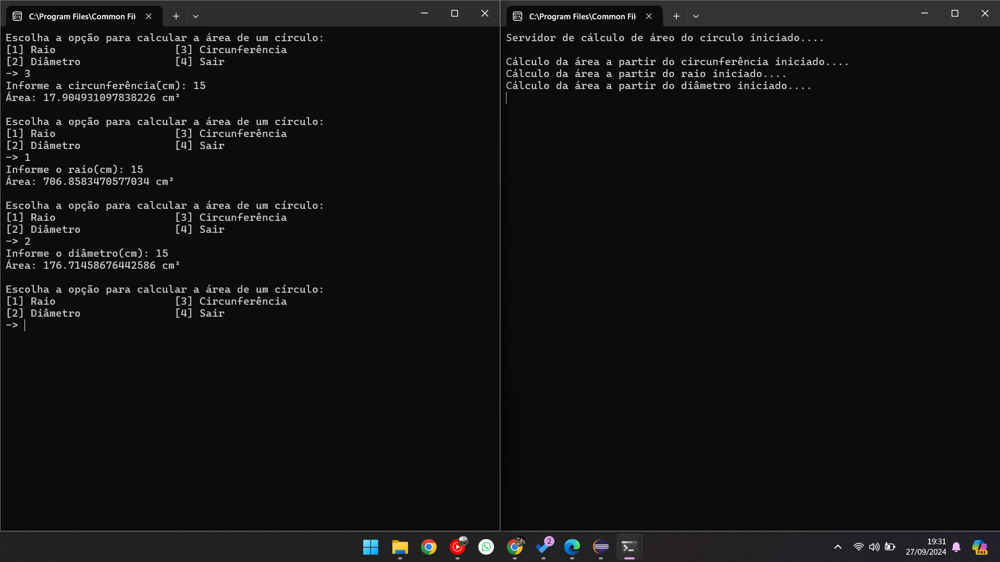

# Projeto RMI - Cálculo de Área de um Círculo

Este projeto utiliza **Java RMI (Remote Method Invocation)** para criar uma aplicação cliente-servidor, onde o cliente solicita o cálculo da área de um círculo ao servidor, fornecendo o raio, diâmetro ou circunferência.
Esse projeto foi apresentado a desciplina de Sistemas Distribuidos ministrada pelo professor Jefferson Silva Lopes.

Abaixo, temos uma imagem que ilustra o funcionamento do projeto.

